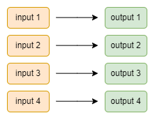
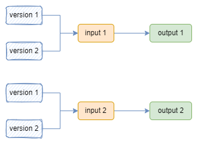

我第一次听说 Salsa，第一次听说增量计算（incremental computation）的时候，就有一个疑问：这和 Python 中的 [`functools.cache`](https://docs.python.org/3/library/functools.html#functools.cache) 有什么区别？

现在我对 Salsa 更熟悉了，再次面对这个问题的时候，仍然不能很好地回答这个问题，但也有些想法，先记录下来。

```rust
fn func(input: Input) -> Output {
    // ...
}

fn main() {
    ...
    let output1 = func(input)
    let output2 = func(input) // do not need to execute func again
}
```

输入同样的 `input`，第二次调用 `func` 时，可以直接从缓存中读取结果，而不需要再次执行 `func`。对于每一个不同的 `input`，保存之前的计算结果，下次调用时先查找数据库，没有找到才执行计算，Python 中的 `functools.cache` 就是这么做的。当然，还可以使用一些缓存替换策略，比如 LRU， Python 中 [`functools.lru_cache`](https://docs.python.org/3/library/functools.html#functools.lru_cache) 就是这么做的。

Salsa 是这么做的吗？显然不是。至少 Salsa 使用起来要比 `functools.cache` 复杂得多 ^_^。

我能明显感觉到，Salsa 和 `functools.cache` 是有很大区别的，但这个区别到底是什么，我好像又说不清楚。。。我好像有点思路，我尝试捋一捋

Salsa 想解决的问题，或者说适用的场景并不是我上面伪代码所示的，而应该像这样

```rust
fn main() {
    let mut input = ...;
    loop {
        let output = your_program(&input);
        modify(&mut input);
    }
}
```
> You start out with an input that has some value. You invoke your program to get back a result. Some time later, you modify the input and invoke your program again. Our goal is to make this second call faster by re-using some of the results from the first call.  
-- https://salsa-rs.netlify.app/overview.html#goal-of-salsa

一个重要的点是，我们是在 loop 之中不断修改 `input`。如果换做 `functools.cache`，它解决的问题应该是

```rust
fn main() {
    let input0 = ...;
    let output = your_program(&input0);

    let input1 = ...;
    let output = your_program(&input1);

    let input2 = ...;
    let output = your_program(&input2);

    ...
}
```

Salsa 强调的是 `input` change，而 `functools.cache` 是没有 `input` change 的，只有不同的 `input`。

另一方面，在 `functools.cache` 中，每个 `input` 地位是同等的




而对 Salsa 来说，一个 `input` 如果发生了改变，那么它之前的版本就没有用了，所有为旧 `input` 保存的计算结果都可以丢弃了。Salsa 系统中，是没有太大的存储压力的，这一点和 `functools.cache` 是非常不一样的，完全可以以 Salsa 为核心写一个复杂软件，比如 `rust-analyzer`，但无法想象以 `functools.cache` 为核心构造一个软件。



